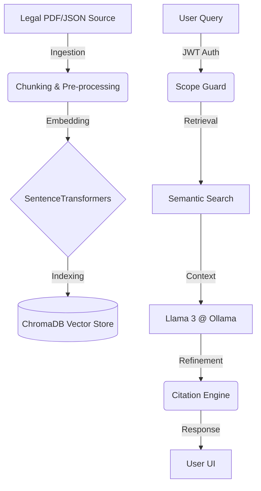

# 🛡️ PolicyLens: EU Tech Policy RAG


**PolicyLens** is a high-performance Retrieval-Augmented Generation (RAG) engine designed for legal professionals and policy researchers to navigate the complex landscape of EU Tech Policy (GDPR, AI Act, NIS2).

---

## 🚀 The Engineering Pipeline

A deep dive into how PolicyLens transforms raw legal PDFs into actionable intelligence.



---

## ✨ Key Features

- **🔐 Multi-Provider Auth**: Secure JWT-based sessions via GitHub & Google OAuth.
- **🛡️ Scope Guard**: Advanced "Hallucination Protection" that ensures the AI only answers tech-policy related questions.
- **📚 Verified Citations**: Every claim is backed by direct references to specific Articles and legal documents.
- **📊 Evaluation Suite**: Built-in benchmarking for Faithfulness, Retrieval Accuracy, and Token Overlap.
- **🐳 One-Click Deploy**: Full Docker orchestration with Nginx reverse proxy and Ollama integration.

---
## ⚡ Performance Optimization

PolicyLens is built for speed. By leveraging a **Unified Local Redis Cache**, we achieve:
- **Instant Responses**: Repetitive queries are served from memory in **< 0.5s**, bypassing the LLM.
- **Dual-Layer Caching**:
    - **Q&A Cache**: Results are stored with a **1-hour TTL** to balance speed with legal freshness.
    - **Embedding Cache**: Mathematical "fingerprints" are stored **indefinitely** to eliminate redundant vector computations.
- **Resource Efficiency**: Significant reduction in VPS CPU/GPU load by avoiding redundant LLM generations.

---

## 🛠️ Tech Stack

- **Backend**: FastAPI, SQLAlchemy, Authlib, PyJWT.
- **Frontend**: React (Vite), Lucide Icons, Axios.
- **AI/ML**: Ollama (Llama3), SentenceTransformers (MiniLM).
- **Database**: PostgreSQL (Metadata), ChromaDB (Vectors).
- **Cache**: Redis (Embeddings & Q&A).

---

## 🏃 Getting Started

### Prerequisites
- Docker & Docker Compose
- OAuth Credentials (Google/GitHub)

### 1. Quick Setup
Run the setup script to prepare your environment and `.env` template:
```bash
bash deployment/scripts/setup.sh
```

### 2. Configure Environment
Edit the `.env` file with your credentials:
```env
# OAuth
GOOGLE_CLIENT_ID=...
GITHUB_CLIENT_ID=...

# Security
JWT_SECRET=yoursecretsignkey
```

### 3. Launch
Deploy the entire stack (API, UI, DB, Ollama, Llama3):
```bash
bash deployment/scripts/deploy.sh
```
*The script will automatically build images and pull the **Llama3** model.*

---


## 📈 Evaluation & Metrics

---

## ⚖️ Legal Disclaimer
*PolicyLens is an AI research tool. It provides legal information based on public EU documentation but does not constitute formal legal advice.*

---
<p align="center">Made with ❤️ for the EU Tech Policy Community</p>
